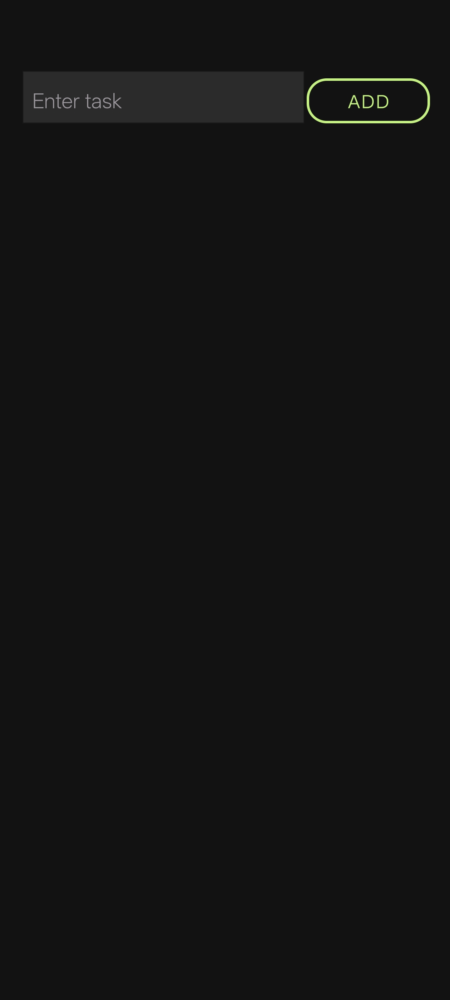
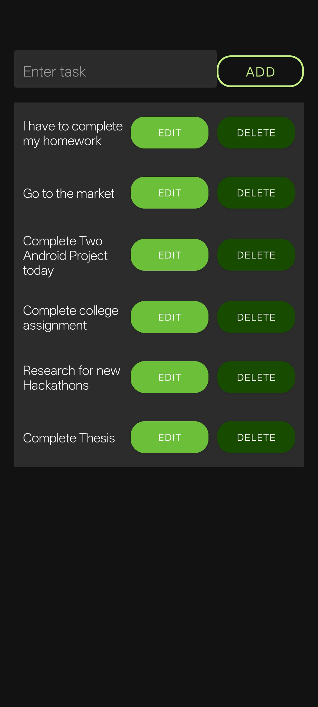

# UzToDo List
**PRODIGY_AD_02**

An Android To-Do List app that allows users to add, edit, and delete tasks. It helps users stay organized with a simple and intuitive interface. Tasks are managed dynamically, and the app provides a minimal yet effective productivity solution.


## Summary
UzToDo List is a simple Android To-Do List app that helps users manage their daily tasks. Users can add, edit, and delete tasks with ease, making productivity simple and efficient.

## Features
- ➕ Add new tasks  
- ✏️ Edit existing tasks  
- ❌ Delete tasks  
- 📋 Task list with RecyclerView for smooth scrolling  
- 🗑️ Auto-update list when tasks are modified  

## Tech Stack
- Android Studio (Java/Kotlin)  
- RecyclerView & Adapter  
- CardView (for UI)  

## Screenshots
  
  

## How to Run
1. Clone the repo:
   ```bash
   git clone https://github.com/syeduzair-it/PRODIGY_AD_02.git
   cd PRODIGY_AD_02
